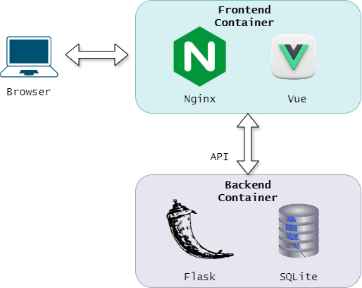
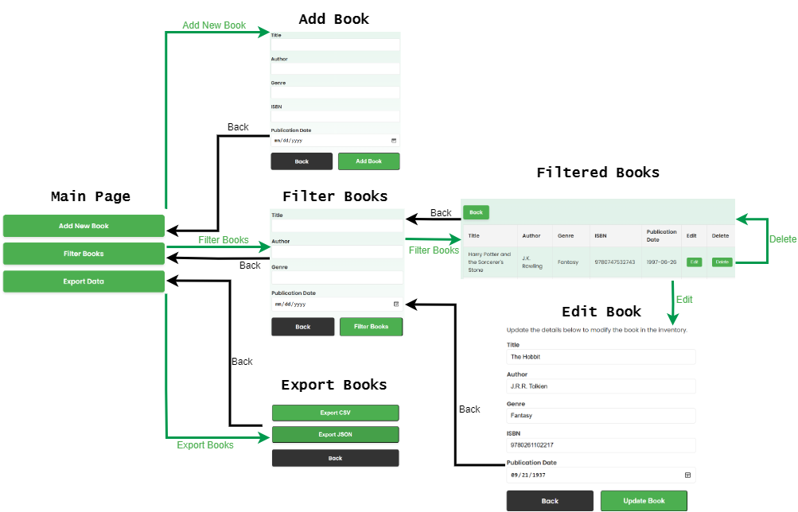

# Book Inventory System

This is a web-based book inventory management system built using Flask for the backend and Vue.js for the frontend. The application allows users to manage a collection of books by adding, editing, filtering, and exporting data.

## Features

- **Add New Book**: Add details about a new book (title, author, genre, ISBN, publication date).
- **Filter Books**: Search for books based on different criteria.
- **Edit Book**: Modify the details of a book in the inventory.
- **Delete Book**: Remove a book from the inventory.
- **Export Data**: Export the book list in CSV or JSON format.

## Project Structure

The project is containerized using Docker with the following structure:
- **Frontend**: Vue.js application served via Nginx.
- **Backend**: Flask API handling CRUD operations and database interactions with SQLite (local development) or MySQL (production-ready configuration).

Below is a simple diagram representing the structure of the project:



## User Flow

Here is a flow diagram showing the user interactions within the system:



## Live Demo

The project is currently live and publicly accessible. You can try it at the following link:

[https://book-inventory-sb-656844231878.us-central1.run.app/](https://book-inventory-sb-656844231878.us-central1.run.app/)

## Deployment Instructions

### Prerequisites

- Docker and Docker Compose should be installed and running on your machine.

### Clone the Repository

1. Clone the repository to your local machine:

   ```bash
   git clone https://github.com/frankrodrigo/book-inventory-v2.git
    

2. Navigate to the project directory.
    ```bash
    cd book-inventory-v2


3. Build the Docker images for both the backend and frontend by running:

    ```bash
    docker-compose build

4. After the build completes, run the application using Docker Compose:

    ```bash
    docker-compose up

The application will be available at:

http://localhost:8080


## Environment Variables
The frontend of the application uses the VUE_APP_BACKEND_URL environment variable to connect to the Flask backend API. When deploying the frontend, be sure to set this environment variable to the correct public IP or domain of the backend API.

For example:
    VUE_APP_BACKEND_URL=https://flask-backend-xxxxxx.run.app

## Troubleshooting

- Docker Issues: If you run into issues related to Docker, ensure that you have the latest version of Docker and Docker Compose installed.
- Environment Variables: Double-check the VUE_APP_BACKEND_URL environment variable when deploying the frontend to ensure it points to the correct backend URL.

## Technologies Used
- Frontend: Vue.js, Nginx
- Backend: Flask, SQLite (local), MySQL (production-ready)
- Containerization: Docker, Docker Compose
- Deployment: Google Cloud Run (live demo)

## License
This project is licensed under the MIT License.

